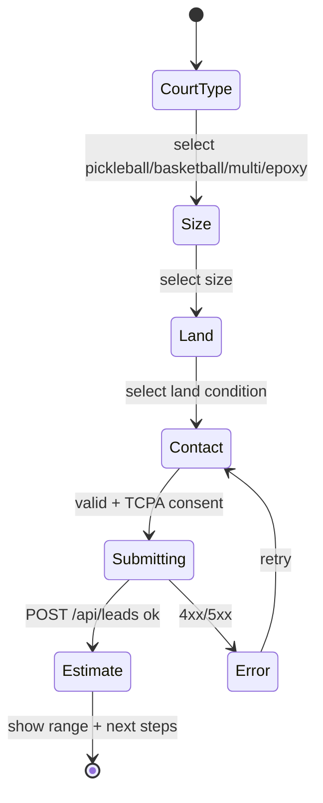

> Purpose: Define how visitors become leads — the conversion model, funnel, CTAs, and friction management.

Status: draft

# Conversion Strategy

## Principle

Match the offer to intent at every step, minimize friction before value, and capture the lead even when a downstream step (render) fails. The two engagement engines — **estimator** and **Backyard Previewer** — both end in a captured lead and a sub-60s owner alert.

## The conversion model

```
Attract (SEO city page / Meta ad)
   → Engage (Estimator OR Previewer — give value before asking)
   → Capture (lead form, minimal fields, TCPA consent)
   → Confirm (/thank-you + render reveal)
   → Respond (sub-60s SMS/owner alert — speed-to-lead)
```

We deliberately **give value first** (a price range, or a render of their yard) before asking for full contact details. This raises completion and lead quality.

## Two paths, one lead

| Path | What the visitor gets | When we ask for contact |
|---|---|---|
| **Estimator** | A credible price range for their court | After court type/size/land condition; contact step is last |
| **Previewer** | A photorealistic court in *their* yard | After upload; can reveal render then ask, or ask in parallel while render runs |

Both write a `leads` row via `POST /api/leads` and (for the previewer) link `render_id`.

## Estimator funnel (state machine)



- Each step is one decision (low cognitive load). Progress indicator shown.
- The price range is computed from court type × size × land condition (see [feat-court-estimator-funnel.md](../04-features/feat-court-estimator-funnel.md)).
- Contact step collects name, phone, email, address + **TCPA consent checkbox** (required if SMS will fire).

## Previewer funnel

See full spec in [feat-backyard-previewer.md](../04-features/feat-backyard-previewer.md). Conversion-relevant points:

- Upload → async render; **never block.** Show progress with an honest ETA ("~15 seconds").
- On success: before/after drag slider — the "wow" moment — then prompt to "get my exact quote."
- On failure: capture the lead anyway with "our designer will hand-render yours and text it over."

## CTA hierarchy

| Priority | CTA | Placement |
|---|---|---|
| Primary | "Get My Estimate" | Header button, hero, sticky mobile bar, end of every section |
| Primary | "Preview It In My Yard" | Hero secondary, previewer teaser, city pages |
| Secondary | "See Our Work" (gallery) | Home, city pages |
| Tertiary | Phone tap-to-call | Header (mobile), footer |

- **Sticky mobile CTA bar** keeps "Get Estimate" / "Preview" one tap away (mobile-first audience).

## Friction management

- **Progressive disclosure:** ask for the easy stuff first, contact last.
- **Minimal required fields:** name, phone OR email, plus consent. Address optional but encouraged (improves owner response + render relevance).
- **Inline validation** (Zod + React Hook Form) with helpful messages.
- **Always-available escape hatch:** a plain `/contact` form for visitors who just want to talk.
- **Trust near the ask:** 4.8★, HBA badge, "free estimate, no obligation."

## Speed-to-lead (the close)

The conversion isn't done at submit — it's done when the owner responds. On every lead:
1. Server fires `LEAD_WEBHOOK_URL` (Make/Zapier/GHL) → SMS to owner + (consented) to lead.
2. Resend email to `OWNER_EMAIL` with lead details + render link.
3. Meta CAPI `Lead` event for attribution.

Target K9: < 60s. See [feat-lead-pipeline.md](../04-features/feat-lead-pipeline.md).

## Anti-patterns we reject

- No long single-page form. No asking for everything up front. No precise unqualified quote. No render that blocks submit. No SMS without consent.

→ Implemented across [feat-court-estimator-funnel.md](../04-features/feat-court-estimator-funnel.md), [feat-backyard-previewer.md](../04-features/feat-backyard-previewer.md), [feat-lead-pipeline.md](../04-features/feat-lead-pipeline.md).
