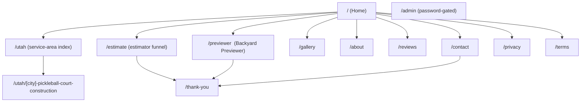

> Purpose: Define the full sitemap, URL scheme, route table, and navigation model for the site.

Status: draft

# Information Architecture

## Sitemap (Mermaid)



## URL scheme

- **Canonical, lowercase, hyphenated.** No trailing slash (Vercel default).
- **City pages:** `/utah/[city]-pickleball-court-construction` where `[city]` is the `cities.slug` (e.g. `/utah/draper-pickleball-court-construction`, `/utah/park-city-pickleball-court-construction`).
  - DECISION (ADR-003): city-only, not service×city. "pickleball-court-construction" is the primary term because pickleball is the lead service; the page covers all services in sections.
- **Service-area index:** `/utah` lists all published cities.
- **Funnels:** `/estimate`, `/previewer` (also embedded as components on home + city pages, but addressable directly for ads).
- **Legal:** `/privacy`, `/terms`.
- **Admin:** `/admin` (and `/admin/leads`, `/admin/renders`), gated by `ADMIN_PASSWORD`.

## Route table

| Route | Rendering | Source | Notes |
|---|---|---|---|
| `/` | Static (SSG) + client islands | hardcoded copy | Hero, estimator CTA, previewer teaser, gallery, social proof |
| `/utah` | SSG, revalidate | `cities` where `published` | Index + map of service area |
| `/utah/[city]-pickleball-court-construction` | SSG via `generateStaticParams`, ISR revalidate | `cities` row + `testimonials` | One per published city |
| `/estimate` | Client (interactive) shell, SSG frame | n/a | Posts `/api/leads` |
| `/previewer` | Client (interactive) shell | n/a | Posts `/api/renders` then `/api/leads` |
| `/gallery` | SSG | hardcoded/seeded images | |
| `/about` | SSG | hardcoded | HBA, story, team |
| `/reviews` | SSG, revalidate | `testimonials` where `published` | |
| `/contact` | Client form shell | n/a | Posts `/api/leads` |
| `/thank-you` | SSG | n/a | Confirmation + next steps; render reveal if present |
| `/privacy`, `/terms` | SSG | hardcoded | |
| `/admin`, `/admin/leads`, `/admin/renders` | Server, dynamic | `leads`, `renders` | Password-gated, `noindex` |
| `/api/*` | Route handlers | — | See [api-contracts.md](../03-architecture/api-contracts.md) |
| `/sitemap.xml` | Generated | `cities` + static | See [seo-strategy.md](./seo-strategy.md) |
| `/robots.txt` | Generated | — | Disallow `/admin`, `/api` |

## App Router file map (target)

```
app/
  layout.tsx                 # root: fonts, header, footer, GA4, Pixel
  page.tsx                   # /
  utah/
    page.tsx                 # /utah index
    [city]-pickleball-court-construction/   # see note
      page.tsx               # dynamic city page (generateStaticParams)
  estimate/page.tsx
  previewer/page.tsx
  gallery/page.tsx
  about/page.tsx
  reviews/page.tsx
  contact/page.tsx
  thank-you/page.tsx
  privacy/page.tsx
  terms/page.tsx
  admin/
    layout.tsx               # password gate
    page.tsx
    leads/page.tsx
    renders/page.tsx
  api/
    leads/route.ts
    renders/route.ts
    renders/[id]/route.ts
    renders/webhook/route.ts
    meta-capi/route.ts
  sitemap.ts
  robots.ts
```

> Implementation note: Next dynamic segments can't contain a literal suffix inside the bracket. Implement city pages as a single dynamic segment `app/utah/[citySlug]/page.tsx` and treat the full path token. ASSUMPTION/OPEN DECISION (minor): either (a) route `app/utah/[slug]/page.tsx` and store the full slug `draper-pickleball-court-construction` style, or (b) keep `cities.slug = draper` and build the suffix in a rewrite. **Recommendation:** store `cities.slug = draper`, route `app/utah/[city]/page.tsx`, and use a `next.config` rewrite/middleware so the public URL is `/utah/draper-pickleball-court-construction`. Confirm in P3.

## Navigation model

### Header (desktop)
`Logo | Court Types ▾ | Service Area | Gallery | Reviews | [Get Estimate →]`
- "Court Types" dropdown: Pickleball, Basketball, Multi-Sport, Epoxy Flooring (anchor to home sections for v1).
- Primary CTA button "Get Estimate" (navy filled).

### Header (mobile)
`Logo | [Estimate] | ☰`
- Hamburger reveals full nav + a "Preview your yard" highlighted item.

### Footer
- Columns: Court Types · Service Area (top cities + "all cities") · Company (About, Reviews, Contact) · Legal (Privacy, Terms).
- NAP block (Name/Address/Phone) for local SEO consistency, HBA + 4.8★ badges.

### Cross-page linking (SEO)
- Every city page links to 3–5 nearby cities ("Also serving …") for internal link equity and to reinforce locality.
- `/utah` links to all published cities.
- Home links to top cities.

→ Drives [seo-strategy.md](./seo-strategy.md), [page-templates.md](../05-design/page-templates.md), [components.md](../05-design/components.md).
