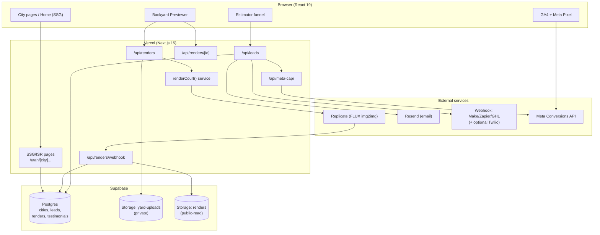
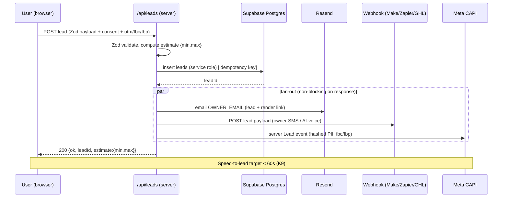
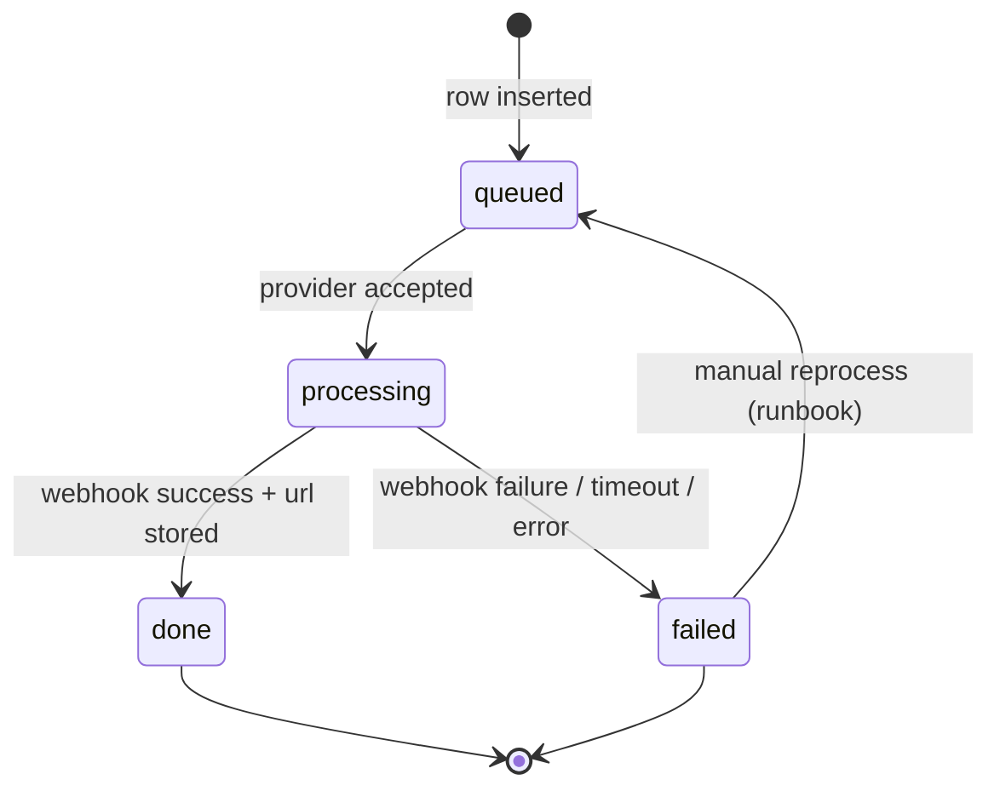

> Purpose: Show the system components, data flows, and the request lifecycles for leads and renders.

Status: draft

# System Architecture

## Component diagram



## Component responsibilities

| Component | Responsibility |
|---|---|
| SSG/ISR pages | Render crawlable HTML for home, `/utah`, city pages, etc. from `cities`/`testimonials` |
| `/api/leads` | Validate lead (Zod), insert `leads`, fan out to Resend + webhook + Meta CAPI, return estimate |
| `/api/renders` | Validate + accept multipart image, strip-EXIF check, upload to `yard-uploads`, insert `renders(queued)`, kick off `renderCourt()` async, return `renderId` |
| `/api/renders/[id]` | Poll status for the client |
| `/api/renders/webhook` | Receive provider callback → set `done`/`failed`, store rendered URL/latency/cost |
| `/api/meta-capi` | Send server `Lead` event with hashed PII + fbc/fbp |
| `renderCourt()` | Provider-agnostic render call; returns provider/model/prompt + prediction id |
| Postgres | All structured data; RLS-enforced |
| `yard-uploads` (private) | EXIF-stripped uploads, server-access only |
| `renders` (public-read) | Finished render images for the slider/reveal |

## Trust & key boundaries

- **Client** uses only `SUPABASE_ANON_KEY` (subject to RLS) + public IDs. It can read published `cities`/`testimonials`. It cannot read/write `leads`/`renders` directly.
- **Server (Vercel functions)** uses `SUPABASE_SERVICE_ROLE_KEY` (bypasses RLS) for all `leads`/`renders` writes. Never shipped to client (Pitfall P11).
- All third-party secrets (Replicate, Resend, Meta CAPI token, webhook URL) are server-only env vars. See [environment-and-secrets.md](./environment-and-secrets.md).

## Lead request lifecycle



If fan-out calls fail, the lead is still persisted and the user still gets success; failures are logged and retried/alerted (see [monitoring-and-logging.md](../07-ops/monitoring-and-logging.md)).

## Render job lifecycle

```mermaid
sequenceDiagram
  participant U as User (browser)
  participant RR as /api/renders
  participant UP as Storage yard-uploads
  participant SVC as renderCourt()
  participant P as Replicate
  participant WH as /api/renders/webhook
  participant REN as Storage renders
  participant DB as Postgres
  participant ID as /api/renders/[id]

  U->>U: validate (type/size), downscale ~1536px, strip EXIF
  U->>RR: POST multipart (image, courtType)
  RR->>UP: upload (private)
  RR->>DB: insert renders(status=queued)
  RR->>SVC: renderCourt({imageUrl, courtType, prompt})
  SVC->>P: create prediction (img2img, strength 0.55-0.70, webhook=/api/renders/webhook)
  RR-->>U: 200 {ok, renderId, status:"queued"}
  loop poll (~2s)
    U->>ID: GET /api/renders/:id
    ID->>DB: read status
    ID-->>U: {status, renderedImageUrl?}
  end
  P-->>WH: callback (succeeded|failed, output url, metrics)
  WH->>REN: store rendered image (public-read)
  WH->>DB: update renders(done/failed, url, latency_ms, cost_usd)
  Note over U: on done -> before/after slider; on failed -> graceful copy, still capture lead
```

### Render state machine



→ Data structures: [data-model.md](./data-model.md). Endpoint contracts: [api-contracts.md](./api-contracts.md). External wiring: [integrations.md](./integrations.md).
