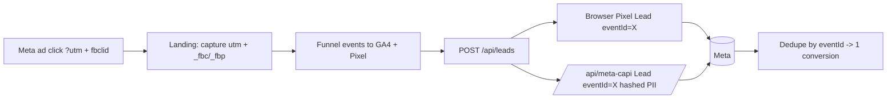

> Purpose: Spec analytics + attribution — event model, Meta Pixel/CAPI dedupe, UTM/fbc/fbp capture, GA4, and acceptance criteria.

Status: draft

# Feature: Analytics & Attribution

Pillar 3 (attribution). Make every funnel step measurable and every lead attributable, with server-side Meta CAPI so the ad optimizer gets clean signal (lower CPL, K7).

## What we capture per visitor/lead
- **UTM params** (`utm_source/medium/campaign/term/content`) — read from URL on landing, persisted (cookie/localStorage), stored on the lead's `utm` jsonb.
- **fbc / fbp** — `_fbc` and `_fbp` cookies, stored on the lead and sent to CAPI.
- **Source** — `estimator | previewer | contact`.

## Event model (GA4 + Pixel)

| Event | When | Params |
|---|---|---|
| `page_view` | route view | path, city_slug? |
| `estimator_start` | funnel begins | source |
| `estimator_step` | each step | step, value |
| `estimator_complete` | estimate shown | estimate_min, estimate_max, court_type |
| `render_start` | photo uploaded | court_type |
| `render_done` | render success | latency_ms |
| `render_failed` | render fail/timeout | reason |
| `lead_submit` | lead created | source, value (estimate mid), has_render |

- GA4 via `NEXT_PUBLIC_GA_ID`. Meta **Pixel** fires `Lead` (and `ViewContent`/custom) client-side with an `eventId`.

## Meta CAPI (server-side, dedupe)
- On lead insert, `/api/leads` calls `/api/meta-capi` with the same `eventId` the browser Pixel used → Meta deduplicates.
- PII (email/phone) is SHA-256 hashed before send; include `fbc`, `fbp`, `value` (estimate midpoint), `currency: USD`.
- Resilient to iOS/ITP pixel loss → cleaner conversion signal → better optimization → lower CPL.
See contract in [api-contracts.md](../03-architecture/api-contracts.md).

## Attribution flow

## KPIs served
K2/K3 (organic via GSC, not GA), K4 (estimator completion), K5 (previewer engagement), K6/K8 (render→lead, % with render), K7 (Meta CPL), K9 (speed-to-lead via pipeline logs). See [goals-and-kpis.md](../02-strategy/goals-and-kpis.md).

## Privacy
- Cookie/consent notice as required; hash PII before CAPI; no PII in GA4 params. See [security-and-privacy.md](../03-architecture/security-and-privacy.md).

## States (DoD)
- Analytics failures are silent (never block UX). CAPI failure logged; lead capture unaffected.

## Acceptance criteria
- [ ] UTM params captured on landing and persisted to the lead's `utm` jsonb.
- [ ] `_fbc`/`_fbp` captured and stored on the lead and sent to CAPI.
- [ ] All funnel events fire to GA4 with correct params.
- [ ] Browser Pixel `Lead` and server CAPI `Lead` share an `eventId` and dedupe in Meta Events Manager.
- [ ] CAPI sends SHA-256 hashed email/phone, never raw PII; no PII in GA4.
- [ ] CAPI/analytics failures are logged and never break the lead flow.
- [ ] `lead_submit` includes `source`, estimate value, and `has_render`.
- [ ] Verified end-to-end in Meta Events Manager test events + GA4 DebugView before launch.

→ Pipeline [feat-lead-pipeline.md](./feat-lead-pipeline.md); integrations [integrations.md](../03-architecture/integrations.md). Phase P7.
