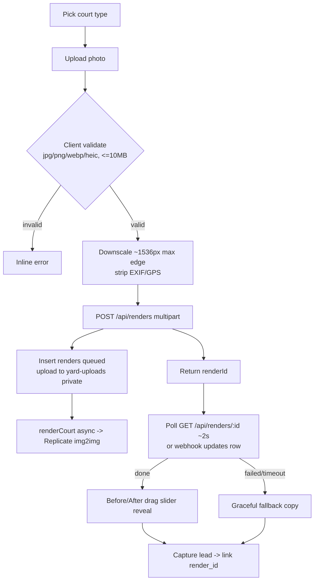

> Purpose: Spec the flagship AI Backyard Previewer — upload→render→reveal flow, prompt, failure handling, and acceptance criteria.

Status: draft

# Feature: AI Backyard Previewer

The flagship differentiator (Pillar 2). Upload a photo of your backyard → get a photorealistic finished court rendered into *that exact yard* → before/after slider → captured lead. Available at `/previewer` and embedded on home + city pages.

## User story
> As a homeowner unsure whether a court would look good in my yard, I upload a photo and within ~15 seconds see a realistic court in my actual backyard — answering my biggest question and making me want a quote.

## Flow

## Client-side handling (Pitfall P9, P12)
- Accept jpg/png/webp/heic; reject others inline.
- Reject > 10MB before upload (`413` server-side as backstop).
- Downscale to ~1536px max edge; re-encode (drops EXIF) and explicitly strip GPS/orientation.

## Server-side (`POST /api/renders`, [api-contracts.md](../03-architecture/api-contracts.md))
- Re-strip EXIF (defense in depth), upload to `yard-uploads` (private), insert `renders(status=queued, provider, model, prompt)`, call `renderCourt()` async with webhook → `/api/renders/webhook`. Never block the HTTP response (Pitfall P5).

## Render engine (ADR-004, ADR-005)
- Provider Replicate (primary), abstracted by `renderCourt()`; img2img (not inpainting v1); `prompt_strength` ~0.55–0.70 to preserve house/fence/trees/landscaping/lighting/shadows/perspective (Pitfall P6).
- Locked architectural prompt parameterized by `courtType` (full text in [integrations.md](../03-architecture/integrations.md)).
- Cost ~$0.01–0.03, latency ~5–20s; persist `cost_usd`, `latency_ms`.

## Reveal
- On `done`: **before/after drag slider** (original vs rendered) — the "wow" moment. CTA: "Get my exact quote." Submitting links `render_id` on the lead.
- The rendered image lives in the public-read `renders` bucket; the original stays private.

## Graceful failure (Pitfall P7)
- On `failed`/timeout: show "Our designer will hand-render yours and text it over" and **still capture the lead** (with the original upload referenced). The owner gets the lead + original photo to hand-render.

## States (DoD)
- **Idle:** court-type picker + upload affordance.
- **Validating:** inline errors (type/size).
- **Uploading:** progress.
- **Queued/Processing:** honest "~15s" progress; cancellable; overall timeout cap.
- **Done:** before/after slider + CTA.
- **Failed/Timeout:** graceful fallback + lead capture.
- **Empty:** clear instructions + sample before/after to set expectations.

## Acceptance criteria
- [ ] User can pick court type, upload a yard photo, and get a rendered result without the request ever blocking on the model.
- [ ] Client validates type (jpg/png/webp/heic) and size (≤10MB), downscales ~1536px, strips EXIF/GPS; server re-strips.
- [ ] Upload lands in the **private** `yard-uploads` bucket; render output in the **public-read** `renders` bucket.
- [ ] `renders` row progresses queued→processing→done|failed with `provider`, `model`, `prompt`, `latency_ms`, `cost_usd` recorded.
- [ ] Polling (`GET /api/renders/:id`) and/or webhook drive the reveal; client has a timeout cap.
- [ ] Successful render shows a working before/after drag slider; rendered image preserves the original house/fence/trees/perspective (qualitative review).
- [ ] On failure/timeout, the graceful fallback shows and the lead is still captured with the original photo referenced.
- [ ] Submitting after a render links `render_id` on the `leads` row.
- [ ] Provider is swappable (Replicate↔Fal) via `renderCourt()` + env, no caller changes.
- [ ] Rate limiting + size limits bound cost/abuse (`413`/`429`).
- [ ] WCAG 2.1 AA (slider keyboard-operable, alt text, focus); 320px→desktop.
- [ ] Lighthouse mobile ≥ 95 on the previewer page (heavy work is async/off-thread where possible).
- [ ] Playwright "complete-a-render" covers success AND failure paths.

→ Engine [integrations.md](../03-architecture/integrations.md); data [data-model.md](../03-architecture/data-model.md); pipeline [feat-lead-pipeline.md](./feat-lead-pipeline.md). Phase P5.
