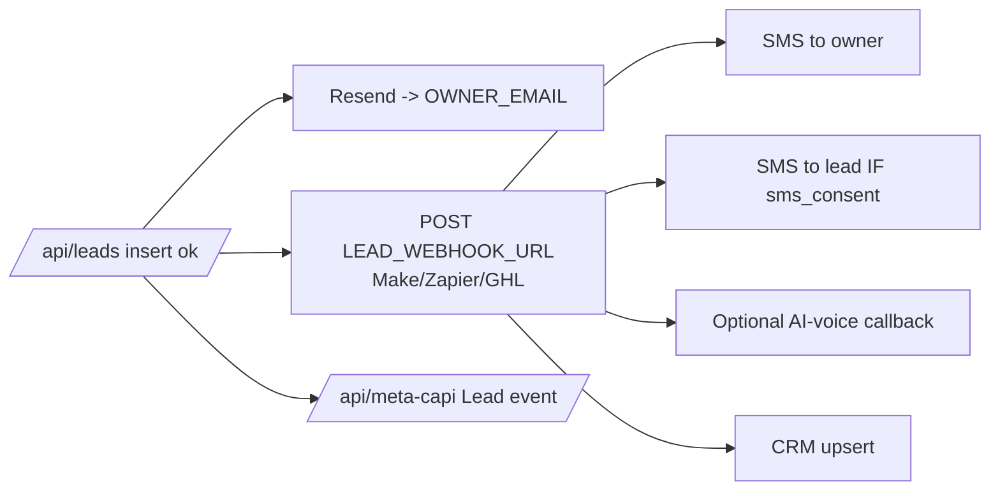

> Purpose: Spec the lead pipeline — capture, fan-out automation, speed-to-lead, and acceptance criteria.

Status: draft

# Feature: Lead Pipeline & Speed-to-Lead Automation

Pillar 3. Every lead is persisted and instantly fanned out to owner email + automation webhook (SMS/AI-voice/CRM) + Meta CAPI, in under 60 seconds (K9).

## User story
> As the owner, the moment someone submits, my phone buzzes with their name, court type, address, estimate, and the rendered court — so I can call back before any competitor.

## Capture
- All forms (estimator, previewer, contact) POST `/api/leads` with a `source` discriminator.
- Server validates (Zod), computes the authoritative estimate, inserts a `leads` row (service role), links `render_id` if present, sets `sms_consent_at` when consented.

## Fan-out (non-blocking, fault-tolerant)

- **Resend email** to `OWNER_EMAIL`: name, phone, email, court type/size, land condition, address, estimate range, city, render link (if any).
- **Webhook** to `LEAD_WEBHOOK_URL` with the full payload incl. `sms_consent`. The owner's Make/Zapier/GHL flow handles owner SMS, consented lead SMS, optional AI-voice, and CRM.
- **Meta CAPI** `Lead` event (hashed PII, fbc/fbp, `eventId` matching the browser Pixel) for attribution ([feat-analytics-attribution.md](./feat-analytics-attribution.md)).
- Fan-out failures are logged + retried and never fail the user-facing response ([monitoring-and-logging.md](../07-ops/monitoring-and-logging.md)).

## Speed-to-lead (K9 < 60s)
- Fan-out fires immediately after insert.
- The webhook is the fastest path to the owner's phone; email is the durable record; CAPI is async attribution.
- Measure: timestamp at insert vs first successful webhook/SMS delivery.

## Lead lifecycle / status
`new → contacted → quoted → won → lost` (managed in the owner dashboard, [feat-owner-dashboard.md](./feat-owner-dashboard.md)). Default `new`.

## TCPA (Pitfall P8)
- A lead is texted only if `sms_consent = true`; the payload carries the flag and the downstream automation must honor it. Owner alerts are exempt.

## States (DoD)
- **Insert ok, all fan-out ok:** normal.
- **Insert ok, some fan-out fails:** user sees success; failures logged/retried; monitor alert if owner notification fails.
- **Insert fails:** `500`; user sees retryable error; nothing fanned out.
- **Duplicate submit:** idempotency key dedupes (one lead, one set of notifications).

## Acceptance criteria
- [ ] Estimator, previewer, and contact forms all create a `leads` row with the correct `source`.
- [ ] On insert, Resend email to `OWNER_EMAIL` fires with full lead details + render link.
- [ ] On insert, `LEAD_WEBHOOK_URL` receives the full payload including `sms_consent`.
- [ ] On insert, a Meta CAPI `Lead` event fires (hashed PII, fbc/fbp, dedupe `eventId`).
- [ ] Fan-out failures are logged and retried; none fails the user response.
- [ ] Lead is texted only when `sms_consent=true`; `sms_consent_at` is stored.
- [ ] Idempotency prevents duplicate leads/notifications on retry/double-submit.
- [ ] Render-linked leads carry `render_id`; the email/webhook include the render URL.
- [ ] Speed-to-lead measurable and < 60s in a test run (K9).
- [ ] No service-role key client-side; all writes server-side.

→ Contracts [api-contracts.md](../03-architecture/api-contracts.md); integrations [integrations.md](../03-architecture/integrations.md). Phase P6.
