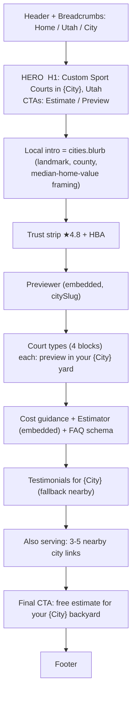

> Purpose: Wireframe the key page templates (home, city, service/estimator, previewer, thank-you) with ASCII/diagram layouts.

Status: draft

# Page Templates (Wireframes)

Mobile-first; wireframes show desktop block order. Components referenced from [components.md](./components.md).

## Home `/`

```
+------------------------------------------------------+
| Header: Logo  Court Types▾  Service Area  Reviews  [Get Estimate] |
+------------------------------------------------------+
| HERO                                                 |
|  H1: Custom Sport Courts, Built With GRIT            |
|  sub: Utah's backyard pickleball/basketball builder  |
|  [Get My Estimate]   [Preview It In My Yard]         |
|  hero image / short before-after teaser              |
+------------------------------------------------------+
| TRUST STRIP:  ★4.8 Angi/HomeAdvisor | HBA member     |
+------------------------------------------------------+
| PREVIEWER TEASER (PreviewerWidget, embedded)         |
|  "See a court in YOUR yard" + sample BeforeAfter     |
+------------------------------------------------------+
| COURT TYPES (4x CourtTypeBlock)                      |
|  Pickleball | Basketball | Multi-Sport | Epoxy       |
+------------------------------------------------------+
| ESTIMATOR TEASER (EstimatorWizard, embedded)         |
+------------------------------------------------------+
| GALLERY strip                                        |
+------------------------------------------------------+
| TESTIMONIALS (carousel)                              |
+------------------------------------------------------+
| SERVICE AREA: top cities + "See all cities" -> /utah |
+------------------------------------------------------+
| FINAL CTA band                                       |
+------------------------------------------------------+
| Footer (court types / area / company / legal / NAP)  |
+------------------------------------------------------+
| [StickyMobileCTA: Estimate | Preview] (mobile only)  |
```

## City page `/utah/{city}-pickleball-court-construction`


JSON-LD: LocalBusiness/Service (areaServed, geo, priceRange) + BreadcrumbList + Review/FAQPage. (See [feat-programmatic-city-pages.md](../04-features/feat-programmatic-city-pages.md).)

## Estimator `/estimate`

```
+------------------------------------------------------+
| Header                                               |
+------------------------------------------------------+
|  ProgressIndicator  ( ● ○ ○ ○ )                      |
|                                                      |
|  STEP 1 Court type:  [Pickleball][Basketball]        |
|                      [Multi-Sport][Epoxy]            |
|                                                      |
|  (Step 2 Size)  (Step 3 Land)  (Step 4 Contact+TCPA) |
|                                                      |
|  [Back]                              [Continue]      |
+------------------------------------------------------+
|  RESULT: "Estimated $XX,XXX – $YY,YYY"               |
|  "Final quote after a free site visit."              |
|  [Preview it in my yard]   [Talk to GRIT]            |
+------------------------------------------------------+
| Trust strip (★4.8, no-obligation)                    |
```
States: in-progress / validating / submitting (spinner) / success (range) / error (retry). See [feat-court-estimator-funnel.md](../04-features/feat-court-estimator-funnel.md).

## Previewer `/previewer`

```
+------------------------------------------------------+
| Header                                               |
+------------------------------------------------------+
| Step A: Court type picker                            |
| Step B: [ Upload a photo of your backyard ]          |
|         hint: jpg/png/webp/heic, <=10MB              |
+------------------------------------------------------+
| PROCESSING:  spinner + "Rendering your court ~15s"   |
|             (cancellable; timeout cap)               |
+------------------------------------------------------+
| DONE:  [ Before  |<-- slider -->|  After ]           |
|        [ Get my exact quote ]  (LeadCapture)         |
+------------------------------------------------------+
| FAILED/TIMEOUT:                                      |
|   "Our designer will hand-render yours and text it   |
|    over." -> [ Send me my preview ] (still captures) |
+------------------------------------------------------+
```
See [feat-backyard-previewer.md](../04-features/feat-backyard-previewer.md).

## Thank-you `/thank-you`

```
+------------------------------------------------------+
| Header                                               |
+------------------------------------------------------+
|  ✓ "Thanks, {name}! GRIT will reach out shortly."    |
|  Next steps: 1) we review  2) free site visit        |
|  3) firm quote                                       |
|                                                      |
|  [If render present: BeforeAfterSlider re-shown]     |
|  Estimate recap: $XX,XXX – $YY,YYY                   |
|  [See our work]  [Back to home]                      |
+------------------------------------------------------+
```
`noindex`. Fires conversion events (Pixel + GA4). See [feat-analytics-attribution.md](../04-features/feat-analytics-attribution.md).

## `/utah` service-area index

```
+------------------------------------------------------+
| H1: Sport Court Builder Serving the Wasatch Front    |
| intro: counties served                               |
| [CityGrid: CityCard per published city -> city page] |
| Map (optional)                                       |
+------------------------------------------------------+
```

## Admin `/admin` (gated)
```
[AuthGate] -> Overview (status counts) | Leads table | Renders table
```
See [feat-owner-dashboard.md](../04-features/feat-owner-dashboard.md).

→ Components [components.md](./components.md); tokens [design-system.md](./design-system.md); IA [information-architecture.md](../02-strategy/information-architecture.md).
