> Purpose: Map phases to demo-able milestones with the order that best serves the pitch.

Status: draft

# Milestones

These are the visible, demo-able checkpoints. Because this is a pitch build, milestones are ordered so the most pitch-relevant capability (the previewer + a couple of city pages) is demoable early, even before full hardening.

> ASSUMPTION: durations are rough and for a single builder working part-time evenings/weekends. Adjust to actual capacity.

| # | Milestone | Phases | Demo-able outcome | Rough effort |
|---|---|---|---|---|
| M0 | Foundations green | P1 | Placeholder deploys; DB/RLS verified | ~0.5 wk |
| M1 | Marketing shell live (≥95) | P2 | Polished home/about/gallery/reviews on a phone, fast | ~1 wk |
| M2 | First city pages | P3 (partial) | 3–5 real city pages with schema, crawlable | ~1 wk |
| M3 | **Previewer demo** | P4→P5 (slim) | Upload a yard photo → court render → slider (the wow) | ~1.5 wk |
| M4 | Estimator + lead pipeline | P4, P6 | Complete a lead; owner gets email + webhook < 60s | ~1 wk |
| M5 | Full city engine | P3 (all) | 25+ published city pages + sitemap | ~0.5 wk |
| M6 | Attribution | P7 | GA4 funnel + Pixel/CAPI dedupe verified | ~0.5 wk |
| M7 | Owner dashboard | P8 | Owner logs in, sees + works leads with renders | ~0.5 wk |
| M8 | Hardened | P9 | DoD across site; Lighthouse/CWV/a11y all green | ~0.5 wk |
| M9 | **Production + pitch** | P10 | Live on prod URL; sitemap submitted; pitch delivered | ~0.5 wk |

## Pitch-critical path (minimum to pitch)
M0 → M1 → M2 (a few cities) → **M3 (previewer)** → M4 (lead pipeline). With these, the pitch script in [client-pitch.md](../08-handoff/client-pitch.md) is fully demonstrable: "renders a court onto a photo of someone's backyard, spins up a Google-friendly page for every city, and texts you the second a lead comes in."

## Milestone exit = phase exit
Each milestone inherits the exit criteria of its phase(s) in [phases.md](./phases.md). A milestone is "done" only when those gates pass and the global [definition-of-done.md](./definition-of-done.md) is met for shipped surfaces.

```mermaid
gantt
  title Milestone sequence (relative)
  dateFormat  X
  axisFormat %s
  section Foundation
  M0 Foundations      :0, 1
  M1 Marketing shell  :1, 2
  section Wow + leads
  M2 First cities     :2, 3
  M3 Previewer        :3, 5
  M4 Estimator+pipe   :5, 6
  section Scale + polish
  M5 Full cities      :6, 7
  M6 Attribution      :7, 8
  M7 Dashboard        :8, 9
  M8 Hardened         :9, 10
  M9 Prod + pitch     :10, 11
```

→ Tasks per milestone: [task-board.md](./task-board.md).
