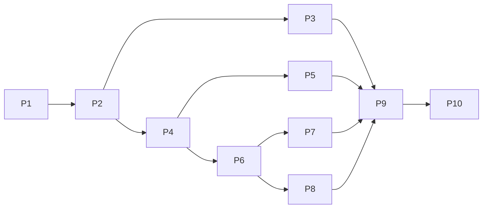

> Purpose: Define the 10 build phases (P1–P10) with explicit entry and exit criteria.

Status: draft

# Phases

Ten phases. Each lists entry criteria (what must be true to start) and exit criteria (the gate to the next phase). The global [definition-of-done.md](./definition-of-done.md) applies to every shippable phase.

## P1 — Scaffold & foundations
- **Goal:** running Next.js 15 app, Supabase wired, env management, CI skeleton.
- **Entry:** repo exists; stack decisions locked ([tech-stack.md](../03-architecture/tech-stack.md)).
- **Work:** Next 15 + React 19 + TS strict; Tailwind + token layer; Supabase project + tables + RLS + buckets ([data-model.md](../03-architecture/data-model.md)); `.env.example`; lint/format; Vitest/Playwright config; Vercel project linked.
- **Exit:** app builds & deploys a placeholder to Vercel; migrations apply; RLS verified (anon can read published cities only); CI runs lint+typecheck+tests; no secret in client bundle.

## P2 — Design system & core pages
- **Goal:** the marketing shell at Lighthouse ≥ 95.
- **Entry:** P1 exit met.
- **Work:** tokens → Tailwind; primitives + chrome (header/footer/sticky CTA) ([components.md](./../05-design/components.md)); home, about, gallery, reviews, contact, privacy, terms, thank-you; social-proof badges + gallery ([feat-social-proof.md](../04-features/feat-social-proof.md)); metadata/canonical; fonts via `next/font`.
- **Exit:** core pages live; Lighthouse mobile ≥ 95 on home; WCAG AA on core pages; no console errors; responsive 320px→desktop.

## P3 — Programmatic city engine
- **Goal:** unique, schema-marked city pages from `cities`.
- **Entry:** P2 exit; ≥ ~15 seed cities fully populated & published.
- **Work:** `generateStaticParams` + city template + `generateMetadata`; JSON-LD; nearby-city links; `/utah` index; `sitemap.ts`/`robots.ts`; uniqueness lint ([feat-programmatic-city-pages.md](../04-features/feat-programmatic-city-pages.md), [seo-strategy.md](../02-strategy/seo-strategy.md)).
- **Exit:** all published cities render crawlable HTML; unique title/meta/H1/blurb (lint passes); valid schema (Rich Results Test); sitemap correct; Lighthouse ≥ 95 on a city page.

## P4 — Estimator funnel
- **Goal:** working estimator → lead.
- **Entry:** P2 exit (P3 not required).
- **Work:** `EstimatorWizard`; pricing config; Zod schema (shared); `POST /api/leads` insert + estimate; all states ([feat-court-estimator-funnel.md](../04-features/feat-court-estimator-funnel.md), [api-contracts.md](../03-architecture/api-contracts.md)).
- **Exit:** funnel completes end-to-end; server returns range; lead row created; loading/error states; Playwright complete-a-lead passes.

## P5 — Backyard previewer
- **Goal:** upload → render → reveal, async + graceful failure.
- **Entry:** P4 exit; render provider key set.
- **Work:** `PreviewerWidget`, uploader (validate/downscale/EXIF), `POST /api/renders`, `renderCourt()` (Replicate), `GET /api/renders/:id`, `/api/renders/webhook`, before/after slider, fallback ([feat-backyard-previewer.md](../04-features/feat-backyard-previewer.md), [integrations.md](../03-architecture/integrations.md)).
- **Exit:** successful render reveals via slider; failure path captures lead; render never blocks request; row lifecycle correct; Playwright complete-a-render (success+failure) passes; cost/latency recorded.

## P6 — Lead pipeline & automation
- **Goal:** every lead fans out in < 60s.
- **Entry:** P4 exit (P5 enriches with render link).
- **Work:** Resend email; `LEAD_WEBHOOK_URL` fan-out; consent handling; idempotency; non-blocking failure handling ([feat-lead-pipeline.md](../04-features/feat-lead-pipeline.md)).
- **Exit:** lead triggers email + webhook reliably; consent enforced; idempotency works; speed-to-lead < 60s measured; failures logged/retried, never break UX.

## P7 — Attribution & analytics
- **Goal:** measurable funnel + clean Meta signal.
- **Entry:** P4/P6 exit.
- **Work:** GA4 events; Meta Pixel; `POST /api/meta-capi` with hashed PII + dedupe; UTM/fbc/fbp capture ([feat-analytics-attribution.md](../04-features/feat-analytics-attribution.md)).
- **Exit:** funnel events in GA4 DebugView; Pixel+CAPI dedupe verified in Meta Events Manager; UTM/fbc/fbp on leads; no PII leakage.

## P8 — Owner dashboard
- **Goal:** owner can see/work leads.
- **Entry:** P6 exit.
- **Work:** `ADMIN_PASSWORD` gate; `/admin`, `/admin/leads`, `/admin/renders`; status updates ([feat-owner-dashboard.md](../04-features/feat-owner-dashboard.md)).
- **Exit:** gated access works; lists + filters + detail + status update work; renders visible (incl failed); noindex; no privileged key client-side.

## P9 — Hardening
- **Goal:** production-ready.
- **Entry:** P3–P8 exit.
- **Work:** full DoD sweep; a11y audit (axe); rate limits; security headers/CSP; error/empty/loading audit; Lighthouse on all templates; monitoring/logging ([monitoring-and-logging.md](../07-ops/monitoring-and-logging.md)); runbook validated.
- **Exit:** DoD met across the site; Lighthouse ≥ 95 mobile on home + city + funnel; CWV good; no console errors; security headers present; monitoring live.

## P10 — Deploy & pitch
- **Goal:** production deploy + owner pitch.
- **Entry:** P9 exit.
- **Work:** production deploy; GSC verify + submit sitemap; Meta/GA in production; pitch demo script ([client-pitch.md](../08-handoff/client-pitch.md)); handoff docs.
- **Exit:** site live on production URL; sitemap submitted; demo runs on a phone; pitch delivered.

## Dependency graph

→ Milestones [milestones.md](./milestones.md); tasks [task-board.md](./task-board.md).
