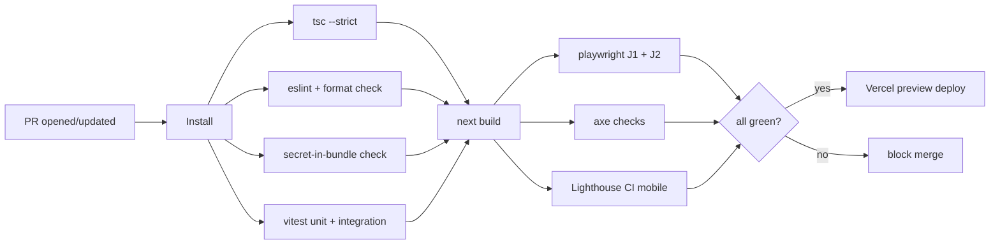

> Purpose: Define the CI/CD pipeline — checks, gates, and the deploy integration with Vercel.

Status: draft

# CI/CD

CI runs on every PR and on `main`. Vercel handles CD (preview per PR, production on merge). CI gates enforce the [definition-of-done.md](../06-build-plan/definition-of-done.md).

## Pipeline (GitHub Actions, ASSUMPTION on provider)

## Required checks (block merge)
- [ ] `tsc --noEmit` strict — no type errors, no `any` (lint rule `@typescript-eslint/no-explicit-any`).
- [ ] ESLint + Prettier check.
- [ ] **Secret-in-bundle check** — grep built client output for server-only secret names (`SUPABASE_SERVICE_ROLE_KEY`, `META_CAPI_TOKEN`, `REPLICATE_API_TOKEN`, `ADMIN_PASSWORD`); fail if found. (Pitfall P11)
- [ ] Vitest unit + integration green.
- [ ] `next build` succeeds.
- [ ] Playwright J1 (complete-a-lead) + J2 (complete-a-render incl. failure) green. ([testing-strategy.md](../06-build-plan/testing-strategy.md))
- [ ] axe: no violations on key templates.
- [ ] Lighthouse CI mobile: Performance ≥ 95 on home/city/funnel; a11y high; CWV good.
- [ ] Uniqueness lint: no duplicate published city `<title>`/`blurb`. (Pitfall P3)

## CD (Vercel)
- **Preview:** auto-deploy on every PR; uses Preview env vars (test pixel, sink webhook).
- **Production:** auto-deploy on merge to `main`; uses Production env vars.
- Supabase migrations applied via CI step or Supabase CLI before/with prod deploy (see [deployment.md](./deployment.md)).

## Secrets in CI
- CI test runs use mock/test keys; never production secrets. E2E external calls are mocked or use sandbox modes ([testing-strategy.md](../06-build-plan/testing-strategy.md)).

## Caching
- Cache `node_modules` and Next build cache to keep CI fast.

## Branch policy
- Work on branches; PR into `main`; required checks must pass; (optional) one review.
- Never commit secrets; `.env*` gitignored except `.env.example`.

→ Deploy details [deployment.md](./deployment.md); test details [testing-strategy.md](../06-build-plan/testing-strategy.md).
